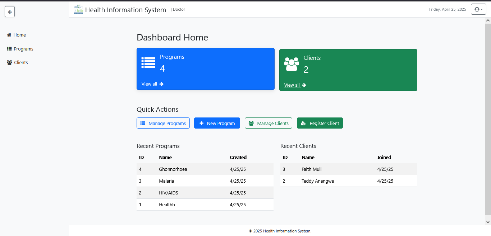
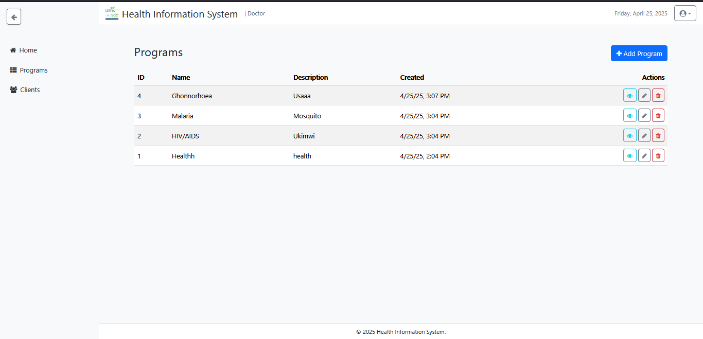

```markdown
# Health Information System 

A **standalone Angular 19** application providing a responsive dashboard for managing health programs and clients. Built with Bootstrap 5, FontAwesome, and api-based services, it demonstrates a full CRUD flow, lazy-loaded routes, and a clean, mobile-first UI.

## Features

- **Dashboard layout** with collapsible sidebar, top navbar, and footer  
- **Program management** (list, add, edit, delete)  
- **Client management** (register, enroll in programs, search, view profile, edit, delete)  
- **api services** for Programs & Clients (CRUD, auto-increment IDs)  
- **Lazy-loaded** standalone components per route  
- **Responsive**, mobile-first design using Bootstrap 5  
- **FontAwesome** icons throughout UI  
- **Template-driven forms** with validation  
- **Pagination** on list views  

---

## Demo

  
  
  
*(Screenshots in `docs/` folder for reference.)*

---

## Tech Stack

- **Angular 19** (Standalone components + `loadComponent`)  
- **Bootstrap 5** (Layout, modals, grid, utilities)  
- **FontAwesome** (Icons)  
- **TypeScript** (Types & interfaces)  
- **api** (Client-side persistence)  
- **HTML5 & CSS3** (Responsive, mobile-first styling)  

---

## Getting Started

### Prerequisites

- [Node.js](https://nodejs.org/) ≥ 16.x  
- [Angular CLI](https://angular.io/cli) ≥ 15.x  

### Installation

1. Clone the repo  
   ```bash
   git clone https://github.com/fayianmwesh/health-information-system.git
   cd health-information-system
   ```

2. Install dependencies  
   ```bash
   npm install
   ```

3. Install UI libraries  
   ```bash
   npm install bootstrap@5 font-awesome
   ```

### Running Locally

1. Add Bootstrap & FontAwesome to `angular.json` (already configured in this repo)  
2. Serve the app  
   ```bash
   ng serve --open
   ```
3. Navigate to `http://localhost:4200/dashboard` in your browser.


## Routing & Lazy Loading

- **Dashboard** (`/dashboard`) is lazy-loaded via `loadComponent`  
- **Programs** under `/dashboard/programs`  
- **Clients**:  
  - List: `/dashboard/clients`  
  - Add: `/dashboard/clients/add`  
  - Edit: `/dashboard/clients/edit/:id`  
  - View: `/dashboard/clients/view/:id`  

All child routes render inside the `<router-outlet>` in the Dashboard’s main content area.

---

## Services & Models

### Models

- **Program** (`program.model.ts`)  
  ```ts
  export interface Program {
    id: number;
    name: string;
    description: string;
    createdAt: string;
  }
  ```

- **Client** (`client.model.ts`)  
  ```ts
  export interface Client {
    id: number;
    firstName: string;
    lastName: string;
    email: string;
    enrolledProgramIds: number[];
    createdAt: string;
  }
  ```

### Services

- **ProgramService**  
  - Methods: `getAll()`, `add()`, `update()`, `delete()`  
  - Persists to `api` keys `programs` & `programs_next_id`

- **ClientService**  
  - Methods: `getAll()`, `add()`, `update()`, `delete()`  
  - Persists to `api` keys `clients` & `clients_next_id`

---

## Styling & Responsiveness

- **Sidebar**: collapsible, off-canvas on mobile  
- **Navbar**: brand + user info + date + dropdown  
- **Footer**: sticky at bottom  
- **Tables**: striped, responsive  
- **Forms & Modals**: Bootstrap components + transitions  
- **Icons**: FontAwesome classes (`fa-plus`, `fa-eye`, etc.)

---

## Future Improvements

- **Backend API**: Replace `api` with real RESTful endpoints  
- **JWT Authentication** & Route Guards  
- **Unit & E2E Tests**: Angular Testing Library / Cypress  
- **State Management**: NgRx or Akita  
- **Accessibility**: ARIA roles, keyboard navigation  
- **Dockerization** & CI/CD pipeline  

---

## Contributing

1. Fork this repo  
2. Create your feature branch: `git checkout -b feature/foo`  
3. Commit your changes: `git commit -m 'feat: add foo'`  
4. Push to your branch: `git push origin feature/foo`  
5. Open a Pull Request

Please follow the [Angular Style Guide](https://angular.io/guide/styleguide) and keep commits clean.

